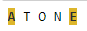
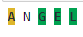
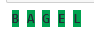

# Wordle

This is a <a href="https://www.nytimes.com/games/wordle/index.html">popular online game</a> ! Let's try to reproduce it.

We first need to make the required imports: 
<ul>
    <li>a module to simulate randomness (so as to have a new word every time we play);</li>
    <li>regex to check if texts match what we want; and</li>
    <li>a corpus of words to pick from.</li>
    </ul>


```python
import random
import re
from nltk.corpus import brown  # nltk needs to be first installed with pip install nltk
```

Then we need to create a list of words to choose from, since the brown corpus has millions of words - and we only need words with five letters. We also want to avoid proper names.


```python
words = []
for x in # brown.words():
    if len(x) == 5 and re.search(r"^A-Z|[\.,]", x) is None:
        words.append(x.upper())  # We harmonise all words with caps
    
word = random.choice(words)  # We pick a random word
```

Then we create a function that will embody the algorithm needed to play the game. That function will take as an input/argument the word guessed by the player.

The first few steps are to check whether that word can even qualify for the game: if it is 5-letter long, and is part of the existing corpus.

Then, if this is the case, we iterate over the letters of the guessed word, one by one, and we check three cases:
<ul>
    <li>if the letter is in the target word and at the same right place (so, same index), we color it green;</li>
    <li>if the letter is in the target word, but not at the right place, we color it yellow; and</li>
    <li>if the letter is not in the target word, we color it grey.</li>
    </ul>
(I found the code to color output on the internet.)


```python
def play(answer):  # We create a function that returns all words in a given format depending on how close we are from the right answer
    answer = answer.upper()  # Get the all caps version of the word to compare with dataset of words
    if len(answer) > 5:  # We first check that the input word in answer fits the requirement: be 5 in len, and in the dataset
        print("Too long")
    elif len(answer) < 5:
        print("Too Short")
    elif answer not in words:
        print("Word does not exist")
    else:  # If this is a proper guess, we proceed to the main part of the function
        for e, letter in enumerate(answer):  # The function enumerate allows you to iterate over a list together with the index
            if letter in word and answer[e] == word[e]:  # If the letter is in the word and at the exact same place, we return a green square
                print('\x1b[1;30;42m' + letter + '\x1b[0m', end=" ")
            elif letter in word:  # If it is in the word, but at a different place, we return a yellow square
                print('\x1b[1;30;43m' + letter + '\x1b[0m', end=" ")
            else:  # Otherwise we just return the letter
                print(letter, end=" ")
```


```python
play("atone")
```



```python
play("angel")
```



```python
play("bagel")
```

