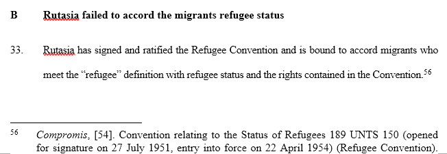
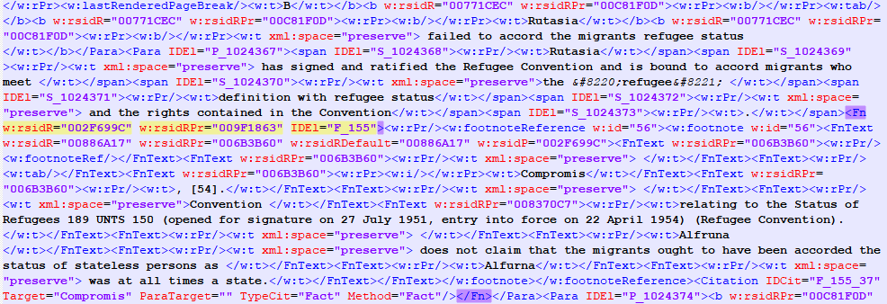
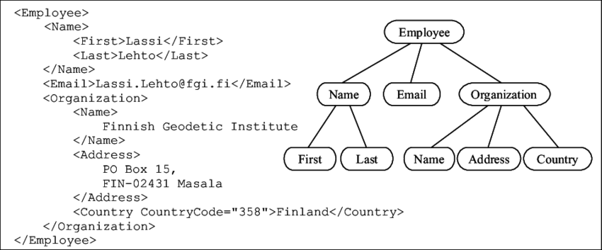

# XML and Structured Files

<b>1. </b> We need to talk a bit about structured files, and notably about XML and xPath. This will be helpful in 
other contexts, as everything we will learn about xml can also be used when scraping wesbites in .html.

<b>2. </b> Shortly put, dataframes are fine, but they can't store text efficiently. On the other hand, you don't 
want to store or work on the basis of pure text: you might want to specify where a particular sentence should be in 
bold, italic; or annotate part of a sentence in according with its role, such as a footnote, a citation, etc. 

A `.docx`, when you go into the details, is actually a text file with a layer of structure that tells Microsoft words a 
number of information as to the formatting of that text. Here is an example of the difference between the two: this 
is the same part of a MSWord document, except the second is the internal .xml structure (after a bunch of 
manipulations on my part to make it somewhat readable).

HTML, or Markdown, are other examples of languages that allow you to structure some text (this course is written 
using both languages).

<b>3. </b> So back to .xml, which stands for "Extensible Markup Language" In the `Not so gibberish` folder, I placed a number of decisions by the 
Conseil d'Etat that were recently released as part of their <a href="https://opendata.conseil-etat.fr/">Open Data program</a>. They 
are .xml files. They are not great, but they'll do.

Let's have a look at one of these files in the Notepad. You can see that the main text is divided between what we 
call elements. Just in HTML, the rule is that you need to enclose the data in elements, with an opening `tag` always 
accompanied by a closed tag of the same name. Tags and sections cannot overlap: when you open a tag in a context, 
you need to close it in that context. Finally, you can also have self-standing, one-tag elements, though they are 
rarer. All tags can be defined or invented by you.

This document doesn't have much of those, but normally you can specify further `attributes` for each element: these 
are data points that will not be seen by a natural reader (unless you look at the code directly), but enclose 
further information (such as formatting, or a URL for a link) for the software, or data scientist, who is probing this 
data. A good example is the , which represents a link, and always has an attribute `href`, which is the url:

<code>
\<\a href="My URL Here">My link here\<\/a>  # Added antislash so that you can see the structure
</code>

You can also see, hopefully, that the information is enclosed in a hierarchical format, like a tree: you start with 
the <i>stump</i>, and then you get branches that can get branches of their own, etc. Here everything is enclosed in a 
`Document` element, itself part of an`xml` element. Yet `Document` has only four direct children, which themselves 
have further children.

"Children" is the usual term, though "descendants" is also sometimes used. Logically, you also have "parents" or 
"siblings".

<b>4. </b>Now, Let's say we have this dataset and want to collect all dates from these decisions. Instead of searching 
each text for a date, the .xml format is helpful: we can see that the date is enclosed in an element called 
`Date_Lecture`. We can just iterate over all files, and collect the dates.

The first thing to understand is that when you parse an .xml document, it's good to start from the stump, also known 
as the root. From there, you typically iterate over their descendants, sometimes by specifying a condition: for 
instance, we can look for all `
` elements, which represent the paragraphs. You also have various levels of 
iterations: over siblings, children, or ancestors. Another alternative is to go through  all descendants and check 
if they are of the required type.

Once you have an element, you can reach `next` and `previous ` elements with the adequate commands. Note that your 
last paragraph here has no `getnext()`.

<b>4. </b> Yet, this is not the easiest way to locate an element when you really need it. Instead, you need to use 
yet another syntax, called xpath. It works like this:

<ul><li>You first identify where to find the required element. You typically start from the source element 
(represented by a dot <code>.</code>), then use one slash if you know the next parent element, or two slashes 
(<code>//</code>) if any descendant would do:</li>
    <li>Then you specify the name of the element, or <code>*</code> if any would do;</li>
    <li>And then you add conditions, in brackets, such as the value of an attribute (introduced by a <code>@</code>),
or based on other functions (such as whether the element contains a certain text);</li>
    <li>Finally, xpath comes with a number of functions, such as <code>contains()</code> (allows you to check that 
the object contains a certain text);</li>
    </ul>

For instance, if we needed to find the element `Date_Lecture` in the xml_file, this is what the xPath expression 
would look like: `root.xpath(".//Date_Lecture[@date='Wednesday 24 November 2021']") `.

Xpath method Returns a list, be careful about this ! If you are sure there is an element that matches you search, 
you can just use xPath expressions in `.find()`.

<u>Exercise 8</u> Go over all files, repeat some of the code we used here, and create a `pandas` dataset based on the  
elements `Numero_Dossier`, `Date_Lecture`, `Date_Audience`, `Avocat_Requerant`, `Type_Decision`, `Type_Recours`, and
`Formation_Jugement`. 
Once it's done, find the most common day of the week for the Conseil d'Etat to hold a hearing ("Audience").

Not all decisions have the same number of elements, and you need to provide for that.

