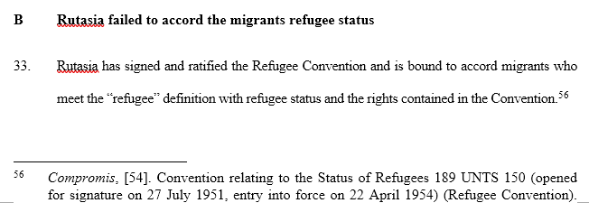
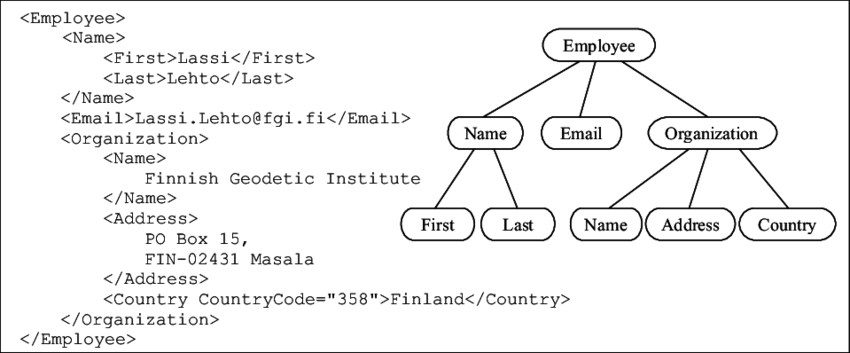

# XML and Structured Files

When you want to store and work with data, pure text is not very helpful; for a start, pure text usually does not include the formatting (bold, italic, etc.), and contains no info as to the role of a particular part of the text (for instance, in a judgment, the difference between the arguments of the parties, the reasoning, or the <i>dispositif</i>.

The solution here is to store your text into a file that follows a structure, according to a particular language. XML, for "Extensible Markup Language", is a structured language. HTML is another.

Likewise, a `.docx`, when you go into the details, is actually a text file with a layer of structure that tells Microsoft words a number of information as to the formatting of that text. Here is an example of the difference between the two: this 
is the same part of a MSWord document, except the second is the internal .xml structure (after a bunch of 
manipulations on my part to make it somewhat readable).




So back to .xml. In your Files, I placed a number of decisions by the Conseil d'Etat that were recently released as part of their <a href="https://opendata.conseil-etat.fr/">Open Data program</a>. They are .xml files. They are not great, but they'll do.

Let's have a look at one of these files, as it appears if you open it with a browser. You can see that the main text is divided between what we call elements. Each element includes an opening `tag` (or "balise", in French), which must be accompanied by a closed tag of the same name. Tags and sections cannot overlap: when you open a tag in a context, 
you need to close it in that context. (You can also have self-standing, one-tag elements, of the form <tag/>, though they are rarer.)


The documents from the Conseil d'Etat don't have much of those, but normally you can specify further `attributes` for each element: these are data points that will not be seen by a natural reader (unless you look at the code directly), but enclose 
further information (such as formatting, or a URL for a link) for the software, or data scientist, who is probing this 
data. A good example is the <code>\<a></a></code>, which represents a link, and always has an attribute `href`, which 
is the url:

<code>
\<\a href="My URL Here">My link here\<\/a>  # The antislash here was added, so that you can see the structure; 
otherwise the element would not appear
</code>

You can also see, hopefully, that the information is enclosed in a hierarchical format, like a tree: you start with 
the <i>root</i>, and then you get branches that can get branches of their own, etc. Here everything is enclosed in a 
`Document` element, itself part of an`xml` element. Yet `Document` has only four direct children, which themselves 
have further children.



"Children" is the usual term, though "descendants" is also sometimes used. Logically, you also have "parents" or 
"siblings".

The interest of storing data in a structured format is not only that you can include more than data (such as metadata), but also that, once you know the structure, you can extract data efficienty from all files that follow that format. The Conseil d'Etat decided a few years ago to release all their judgments according to that format, and code that worked to extract data from judgments back then also works for new judgments - as long as they follow the structure.

In other words, just like using a loop over the content of a list allows you to be agnostic about the data in that list, having a structure allows you to be agnostic about the data that was filled in that structure.

For instance, Let's say we want to collect all dates from these decisions from the Conseil d'Etat. Instead of searching 
each text for a date, the .xml format is helpful: we can see that the date is enclosed in an element called 
`Date_Lecture`. We can just iterate over all files, and collect the dates.

The first thing to understand is that when you parse an .xml document, you need to start from the root. From there, you typically iterate over their descendants, sometimes by specifying a condition: for 
instance, we can look for all `<p>` elements, which represent the paragraphs. You also have various levels of 
iterations: over siblings, children, or ancestors. Another alternative is to go through  all descendants and check 
if they are of the required type.


```python
import pandas as pd
from lxml import etree  # This is one of the main .xml reader module in Python, 
# the etree method from the lxml package. You need to : pip install lxml
import os
from datetime import datetime
from collections import defaultdict, Counter

#os.chdir("../Data/CE")  # We go to the main folder that stores all files
files = os.listdir(".") 
print(len(files))  # There are many files !

file = files[0] # Let's work on the first file to get an example

xml_file = etree.parse(file)  # We first open the .xml file with the "parse" method
root = xml_file.getroot()  # We then look for the "root" of the XML tree, and pass it to a variable root

print(root.attrib)  # You can check the attributes of every element this way
print("Text of the element: " + root.text)  # Likewise, the "text" attribute gives you the text inside an element; 
# root has no text, as you can see everything is in the elements instead
```

    835
    {'{http://www.w3.org/2001/XMLSchema-instance}noNamespaceSchemaLocation': 'validation-document.xsd'}
    Text of the element: 
    


Now, starting from the root, we can go through all its children and grandchildren. There are several ways to do this.


```python
for child in root:  # The parent element also works as a list of its children element, so you can easily iterate over it immediately like this
    print(child.tag)

for paragraph in root.iter("p"):  # Though a better way to do it is with iter(); 
    # this command takes arguments that allow you to filter the descendants
    print(paragraph.text) # This will return the text of the decision, paragraph by paragraph
```

    Donnees_Techniques
    Dossier
    Audience
    Decision
    Vu la procédure suivante :
    Mme B D O'Sullivan a demandé au tribunal administratif de Lyon de condamner la chambre de commerce et d'industrie (CCI) Lyon Métropole Saint-Etienne Roanne à lui verser une somme de 90 658,24 euros en réparation des préjudices qu'elle soutient avoir subis en raison d'une insuffisance de cotisation imputable à l'établissement public, pris en sa qualité d'employeur, au régime de retraite des personnels des chambres consulaires.
    Par un jugement n° 1707967 du 6 novembre 2019, le tribunal administratif de Lyon a rejeté sa demande.
    Par un arrêt n° 20LY00150 du 9 décembre 2021, la cour administrative d'appel de Lyon a rejeté l'appel formé par Mme D O'Sullivan contre ce jugement.
    Par un pourvoi sommaire et un mémoire complémentaire, enregistrés les 9 février et 9 mai 2022 au secrétariat du contentieux du Conseil d'Etat, Mme D O'Sullivan demande au Conseil d'Etat :
    1°) d'annuler cet arrêt ;
    2°) réglant l'affaire au fond, de faire droit à son appel ;
    3°) de mettre à la charge de la chambre de commerce et d'industrie Lyon Métropole Saint-Etienne Roanne la somme de 3 000 euros au titre de l'article L. 761-1 du code de justice administrative.
    Vu les autres pièces du dossier ;
    Vu : 
    - le code de la sécurité sociale ;
    - le décret n° 2015-1690 du 17 décembre 2015 ;
    - le statut du personnel administratif des chambres de commerce et d'industrie ;
    - le code de justice administrative ;
    Après avoir entendu en séance publique :
    - le rapport de M. Frédéric Gueudar Delahaye, conseiller d'Etat,  
    - les conclusions de M. A C de Vendeuil, rapporteur public ;
    La parole ayant été donnée, après les conclusions, à la SCP Foussard, Froger, avocat de Mme D E ;
    Considérant ce qui suit : 
    1.Aux termes de l'article L. 822-1 du code de justice administrative : " Le pourvoi en cassation devant le Conseil d'Etat fait l'objet d'une procédure préalable d'admission. L'admission est refusée par décision juridictionnelle si le pourvoi est irrecevable ou n'est fondé sur aucun moyen sérieux ".
    2.Pour demander l'annulation de l'arrêt qu'elle attaque, Mme D O'Sullivan soutient que la cour administrative d'appel de Lyon a :
    -commis une erreur de droit, ou à tout le moins une erreur de qualification juridique des faits, en jugeant que les dispositions de l'article 26 A du statut général des personnels titulaires des chambres consulaires n'instaurent pas d'obligation de maintenir l'agent autorisé à travailler à temps partiel à un niveau de cotisation égal à celui à temps complet ;
    -entaché son arrêt d'une erreur de qualification juridique des faits, ou à tout le moins d'une dénaturation de ces faits, en considérant que le manquement de la CCI à son devoir d'information quant à l'incidence de sa situation sur la constitution de ses droits à retraite n'était pas à l'origine d'un préjudice, alors que cette information lui aurait à tout le moins permis d'exercer l'option ouverte par l'article L.241-3-1 du code de la sécurité sociale ;
    -insuffisamment motivé son arrêt en ne répondant pas au moyen opérant tiré de l'impossibilité dans laquelle elle s'est trouvée de pouvoir exercer son droit d'option ouvert par l'article L.241-3-1 du code de la sécurité sociale, à raison du défaut d'information.
    3.Aucun de ces moyens n'est de nature à permettre
          
          D E C I D E :
          --------------
    Article 1er : Le pourvoi de Erreur ! Aucune variable de document fournie. n'est pas admis.
    Article 2 : La présente décision sera notifiée à  et à la Chambre De Commerce Et D'industrie Lyon Métropole Saint-etienne RoanneCopie en sera adressée à la chambre de commerce et d'industrie Lyon Métropole Saint-Etienne Roanne.
    Délibéré à l'issue de la séance du 26 octobre 2022 où siégeaient : M. Gilles Pellissier, assesseur, présidant ; M. Benoît Bohnert, conseiller d'Etat et M. Frédéric Gueudar Delahaye, conseiller d'Etat-rapporteur. 
    Rendu le 1er décembre 2022.
          Le président : 
          Signé : M. Gilles Pellissier
    Le rapporteur :
    Signé : M. Frédéric Gueudar Delahaye
          La secrétaire :
          Signé : Mme Corinne SakITEZQOSK


```python
for el in root.iter(["Numero_Dossier", "Date_Lecture"]):  # The filter can also be a list of relevant element names
    print(el.text)
```

    461328
    2022-12-05


Note also that you can navigate between the elements, to jump from elements to their parents, or siblings. This is very helpful if you know the tag of one element but aren't sure of what follows it; or if you want to work on several elements in line.


```python
for el in root:
    pass  # An empty loop to make sure "el" is the last child of root
print("The last child of root is: ", el.tag)

prev_el = el.getprevious() # This method gets you the previous sibling
print(prev_el.tag)
next_el = prev_el.getnext()
print(next_el.tag)
subel = root.getchildren()[1]
print("The second child from the root is: ", subel)
print("Its parent is", subel.getparent())
```

    The last child of root is:  Decision
    Audience
    Decision
    The second child from the root is:  <Element Dossier at 0x7fcc8cdc4900>
    Its parent is <Element Document at 0x7fcc8c3cce00>


Now, coming back to our example, we want to get the date for every decision. Note that if we want to do it for one file, we just need to find the relevant element (tag = "Date_Lecture"), and extract the data from that element.


```python
for el in root.iter("Date_Lecture"):  # the Date_Lecture element contains the judgment's date; 
    # Easiest way in XML is to filter all descendants to get only the one we are interesting in
    date = el.text
print(date)
```

    2022-12-05


Therefore, to obtain it from all judgments, we just need to loop over all files.


```python
for file in files[:10]:  # Remember we defined os.listdir(".") as files above, and looping only over the first 10
    xml_file = etree.parse(file)  # We open each .xml file with the "parse" method
    root = xml_file.getroot()  # And we goot the root
    for el in root.iter("Date_Lecture"):  # the Date_Lecture element contains the judgment's date; 
    # Easiest way in XML is to filter all descendants to get only the one we are interesting in
        date = el.text
    print(date)
```

    2022-12-05
    2022-12-16
    2022-12-20
    2022-12-12
    2022-12-27
    2022-12-09
    2022-12-16
    2022-12-21
    2022-12-09
    2022-12-28


Now, if we wanted to recreate a full database of all relevant data points in each judgment, we can just use the list of list method.
This methods leverages the fact that  a dataframe is nothing but a list of sublists of equal length, with each sublist being a row (see <a href="https://www.geeksforgeeks.org/creating-pandas-dataframe-using-list-of-lists/">here</a> for more details).


```python
details = ["Numero_Dossier", "Date_Lecture", "Date_Audience", "Avocat_Requerant", "Type_Decision", "Type_Recours",
"Formation_Jugement"]  # All the relevant data points/elements in our judgments
lists_details = []  # Easiest way to create a dataframe is first to have a list of lists, 
# and then pass it to pd.Dataframe(lists, columns=details)

for file in files:
    newlist = []  # We create a new, empty sublist, every time we switch to a new file; 
    # that sublist will be filled with relevant data and added to main list; each sublist will have the same length
    XML = etree.parse(file)
    root = XML.getroot()

    for detail in details:  # For each file, we iterate over each type of detail, using a loop
        result = ""
        for el in root.iter(detail):  # and we use this detail to filter from all descendants in root
            result = el.text
        newlist.append(result)  # we then pass the result to the sublist created above

    lists_details.append(newlist)  # Before the loop concludes with one file and passes on to the next, 
    # we append the (filled) newlist to main list

df = pd.DataFrame(lists_details, columns = details)  # Out of the loop, we create a dataframe based on that list of lists
df.head(10)
# df.to_clipboard(index=False) # Finally, we copy the DataFrame so as to paste it (CTRL+V) in Excel
```


<div>
<style scoped>
    .dataframe tbody tr th:only-of-type {
        vertical-align: middle;
    }

    .dataframe tbody tr th {
        vertical-align: top;
    }

    .dataframe thead th {
        text-align: right;
    }
</style>
<table border="1" class="dataframe">
  <thead>
    <tr style="text-align: right;">
      <th></th>
      <th>Numero_Dossier</th>
      <th>Date_Lecture</th>
      <th>Date_Audience</th>
      <th>Avocat_Requerant</th>
      <th>Type_Decision</th>
      <th>Type_Recours</th>
      <th>Formation_Jugement</th>
    </tr>
  </thead>
  <tbody>
    <tr>
      <th>0</th>
      <td>461328</td>
      <td>2022-12-05</td>
      <td>2022-10-26</td>
      <td>ROCHETEAU, UZAN-SARANO &amp; GOULET</td>
      <td>Décision</td>
      <td>Plein contentieux</td>
      <td>7ème chambre jugeant seule</td>
    </tr>
    <tr>
      <th>1</th>
      <td>463896</td>
      <td>2022-12-16</td>
      <td>2022-11-28</td>
      <td></td>
      <td>Décision</td>
      <td>Plein contentieux</td>
      <td>9ème chambre jugeant seule</td>
    </tr>
    <tr>
      <th>2</th>
      <td>469368</td>
      <td>2022-12-20</td>
      <td>2022-12-14</td>
      <td>CRUSOE</td>
      <td>Décision</td>
      <td>Excès de pouvoir</td>
      <td>Juge des référés, formation collégiale</td>
    </tr>
    <tr>
      <th>3</th>
      <td>465668</td>
      <td>2022-12-12</td>
      <td>2022-11-17</td>
      <td></td>
      <td>Décision</td>
      <td>Rectif. d'erreur matérielle</td>
      <td>9ème chambre jugeant seule</td>
    </tr>
    <tr>
      <th>4</th>
      <td>467773</td>
      <td>2022-12-27</td>
      <td></td>
      <td></td>
      <td>Ordonnance</td>
      <td>Excès de pouvoir</td>
      <td>5ème chambre</td>
    </tr>
    <tr>
      <th>5</th>
      <td>464514</td>
      <td>2022-12-09</td>
      <td>2022-11-24</td>
      <td>SCP PIWNICA, MOLINIE</td>
      <td>Décision</td>
      <td>Plein contentieux</td>
      <td>2ème chambre jugeant seule</td>
    </tr>
    <tr>
      <th>6</th>
      <td>465895</td>
      <td>2022-12-16</td>
      <td>2022-12-08</td>
      <td></td>
      <td>Décision</td>
      <td>Plein contentieux</td>
      <td>8ème chambre jugeant seule</td>
    </tr>
    <tr>
      <th>7</th>
      <td>458650</td>
      <td>2022-12-21</td>
      <td>2022-12-02</td>
      <td></td>
      <td>Décision</td>
      <td>Plein contentieux</td>
      <td>9ème et 10ème chambres réunies</td>
    </tr>
    <tr>
      <th>8</th>
      <td>461508</td>
      <td>2022-12-09</td>
      <td>2022-11-24</td>
      <td>SCP GASCHIGNARD, LOISEAU, MASSIGNON</td>
      <td>Décision</td>
      <td>Excès de pouvoir</td>
      <td>2ème chambre jugeant seule</td>
    </tr>
    <tr>
      <th>9</th>
      <td>444845</td>
      <td>2022-12-28</td>
      <td>2022-12-07</td>
      <td>DELALANDE;SCP PIWNICA, MOLINIE</td>
      <td>Décision</td>
      <td>Excès de pouvoir</td>
      <td>6ème et 5ème chambres réunies</td>
    </tr>
  </tbody>
</table>
</div>


