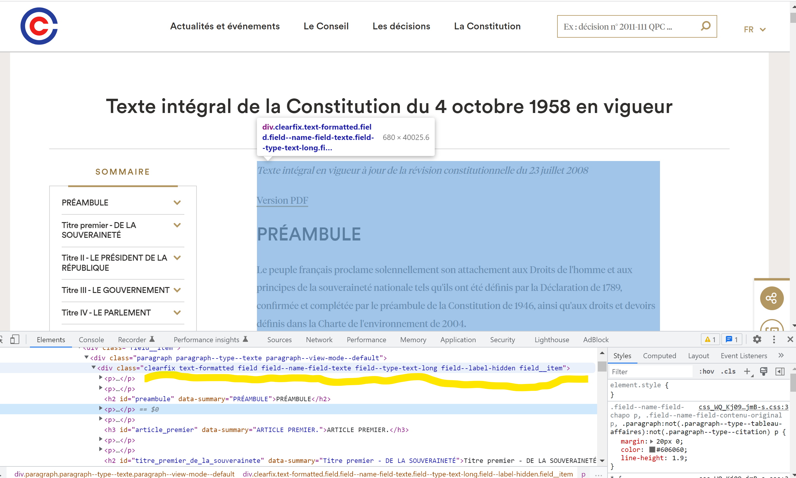
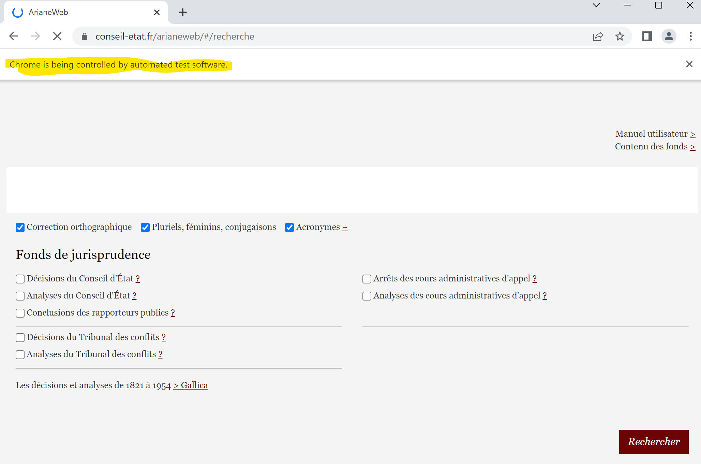

# Scraping

## Requests

We'll start by introducing a basic scraping (one 'p') tool, the `requests` module.

*** Before this, you can find a good overview as to how the internet works <a href="https://www.explainthatstuff.com/internet.html">here</a> ***

For instance, let's take this <a here="https://www.hec.edu/fr/grande-ecole-masters/ms-et-msc/ms/llm-droit-et-management-international/programme">HEC webpage</a>. We can describe this type of webpage as "static", because every one sending a request to the server to this page will see the same result, and you won't be able to change it. It's irrelevant that you can fold/unfold elements, because it's just a trick: the data is already there, it's not being fetched as you click "unfold" (if you 
check the page source, you'll see all the data).

The HEC page is static, so we can use <i>requests</i>. In the code below, we use this package to get the html source code for the HEC webpage, which we put in a variable <code>webpage</code>. We then pass that variable's html data to the module BeautifulSoup, which transforms the original html (a pure string) to a data type that represents the html, and thus comes with specific methods and attributes.


```python
import requests  # Scraping module
from bs4 import BeautifulSoup  # HTML reading module
import regex as re

webpage = requests.get("https://www.hec.edu/fr/grande-ecole-masters/ms-et-msc/ms/llm-droit-et-management-international/programme")  
# We fetch the webpage and pass it to an object
print(webpage.status_code)  # The webpage object comes with distinct methods, such as status code, 
# which tells you if connection was successful: 404 means no
soup = BeautifulSoup(webpage.content)  # We then read the html (which is put as a string in 
# webpage.content) with BeautifulSoup, and pass it to an object we'll call "soup"
prix_ao = soup.find(title="Prix Juridique et Fiscal Allen & Overy")  # Using that soup object, 
# we look for an element whose title (the html attribute) matches the one we are looking for
content = prix_ao.parent.parent.text  # Next, we can use this element to get the element 
# we are actually interested in, which here is the text of the grandparent (.parent.parent)
print(content)
```

    200
    
    
    
          Prix Juridique et Fiscal Allen & Overy
          
    
    
    
    
    Le Prix Juridique et Fiscal a été créé par Allen & Overy et HEC Paris en 2004, à la suite de l’adhésion d’Allen & Overy à la Fondation HEC.
    Chaque année, Allen & Overy récompense trois travaux de recherche (Mastère Spécialisé/LLM Droit et Management International ou Majeure Stratégie Fiscale et Juridique Internationale) dans le cadre du Prix Juridique & Fiscal. Pour postuler, l’étudiant doit obtenir la note A à sa thèse professionnelle et avoir le soutien du Directeur scientifique et du Directeur exécutif du Mastère Spécialisé/LLM.
    
    
    
    


Now, suppose you want to scrap the French constitution from the website of the Conseil constitutionnel. The steps are the same: you ask `requests` to fetch the page, and store it in a variable. You then extract the html from that variable to create a soup.

A few more steps are however needed to get the Constitution, as opposed to the page storing the constitution, and possibly without the `html` code surrounding it.

(Note that, quite often, you'll want to scrap several distinct pages of a website, something you can do with a loop. Sometimes, you don't know in advance what are the pages you'll want to scrap, and there are third-party plugins, known as crawlers, for this.)

To go past this issue, you'll need to manipulate the  `html` and locate what you need. To do so, a module 
called BeautifulSoup is very helpful. But also your browser: what you want to do is:

<ul><li>Go to the webpage on your Browser;</li>
    <li>Inspect or try to find the page source (on Chrome, that would be Right-Click, `Inspect`);</li>
    <li>Locate the highest element holding the data you are looking for;</li>
    <li>Find a way to locate that element with BeautifulSoup;</li>
<li>Perform operations over that element (for instance, extract text);</li>
    </ul>
    
Here, the full constitution is contained in a "div" element with a particular class name that you can just copy and paste from the inspecting tool.




```python
webpage = requests.get("https://www.conseil-constitutionnel.fr/le-bloc-de-constitutionnalite/texte-integral-de-la-constitution-du-4-octobre-1958-en-vigueur") 
# Same logic, we first get the page
soup = BeautifulSoup(webpage.content)  # Then create a soup

cons_div = soup.find("div", class_="field field--name-field-reference-paragraph field--type-entity-reference-revisions field--label-hidden field__items")  
# We look for the main element containing the entire constitution. Note that, by contrast with all 
# other attributes, "class" needs to have an underscore at the end ("class_"); 
# this is because "class" already means something in native python
print(len([x for x in cons_div.descendants])) # how many indirect children in cons_div
```

    1405


This is the easiest part; often, however, you only need one part of a webpage, or want to add conditions to the BeautifulSoup search criteria. One way to do this is to remember that `html`, like `xml`, is a structured language: elements have children and parents, over which you can iterate. For instance, the following will print every title (article numbers, here), in the Constitution.


```python
for child in cons_div.findChildren("h3")[:3]:  # Looking for titles; note that all 'find' methods
     # in Beautifulsoup work from the point of view of the element you use it on, so here it is
     # looking for all children of cons_div - not of the whole soup
    print(child)
```

    <h3 data-summary="ARTICLE PREMIER." id="article_premier">ARTICLE PREMIER.</h3>
    <h3 data-summary="ARTICLE 2." id="article_2">ARTICLE 2.</h3>
    <h3 data-summary="ARTICLE 3." id="article_3">ARTICLE 3.</h3>


To get to the text of the article, once again you need to study the structure of the webpage. Here you'll see that each title has siblings, which are `<p>` elements, and which enclose the relevant text (in an attribute '.text'). Here is some code to reconstruct the Constitution in a dictionary.

Note that if you want to search an element by the text it contains, you can use the command of the form: <code>element.find(Target Name, text=re.compile(your regex pattern here))</code>.


```python
dic_constitution = {} 
for child in cons_div.findChildren("h3"):  # We go over every article title
    text = ""  # We create an empty variable to fill with the text
    article_num = re.search(r"\d+(-\d+)?|PREMIER", child.text).group()  # We get the article 
    # number from regex; notice that some numbers are of the pattern \d+-\d (e.g., Article 88-2),  
    # so we provide for this; the first article is also an exception
    for sib in child.find_all_next(["h3", "p"]):  # We iterate over the next elements
        if sib.name == "h3":  # We check if we have  reached the next article, in which case we 
            # break the loop
            break
        else:  # If we have not reached the next article, we add the text of the element 'p' 
            # to our variable, separated  by a line-break
            text += "\n" + sib.text.strip()  # Strip because online text often has empty strings
            # at the end and beginning of text
    dic_constitution[article_num] = text.strip()  # Once the loop over the text elements is over, 
    # we input it in our dictionary
for x in range(2, 5):
    print("L'article ", str(x), "de la Constitution est: \n", dic_constitution[str(x)])
```

    L'article  2 de la Constitution est: 
     La langue de la République est le français.
    L'emblème national est le drapeau tricolore, bleu, blanc, rouge.
    L'hymne national est « La Marseillaise ».
    La devise de la République est « Liberté, Égalité, Fraternité ».
    Son principe est : gouvernement du peuple, par le peuple et pour le peuple.
    L'article  3 de la Constitution est: 
     La souveraineté nationale appartient au peuple qui l'exerce par ses représentants et par la voie du référendum.
    Aucune section du peuple ni aucun individu ne peut s'en attribuer l'exercice.
    Le suffrage peut être direct ou indirect dans les conditions prévues par la Constitution. Il est toujours universel, égal et secret.
    Sont électeurs, dans les conditions déterminées par la loi, tous les nationaux français majeurs des deux sexes, jouissant de leurs droits civils et politiques.
    L'article  4 de la Constitution est: 
     Les partis et groupements politiques concourent à l'expression du suffrage. Ils se forment et exercent leur activité librement. Ils doivent respecter les principes de la souveraineté nationale et de la démocratie.
    Ils contribuent à la mise en œuvre du principe énoncé au second alinéa de l'article 1er dans les conditions déterminées par la loi.
    La loi garantit les expressions pluralistes des opinions et la participation équitable des partis et groupements politiques à la vie démocratique de la Nation.


The Constitution is divided in parts and sub-sections. The subsections, if you look at the code-source, are  found in elements whose tag is "h2". Let's write an algorithm that returns the section with the most articles (subarticles of the form "56-X" count as one). There are several ways to go about it.


```python
# First way

section_with_most_arts = ""
prev_count = 0 # We initiatlise counter to keep track of which section has highest number 

for child in cons_div.findChildren("h2"):   # First we notice that all "Titres" are put in 
    # h2 elements
    count = 0  # We initialise a counter
    prev = ""  # We initialise an article number (see below)
    for sib in child.find_all_next(["h2", "h3"]):  # Same logic as above: 
        # we iterate over the relevant sections, and break the loop if we encounter another 
        # h2 element - which means we reached next title
        if sib.name == "h2":
            break
        else:
            article_num = re.search(r"\d+|PR", sib.text).group()   # Since subarticles count as 
            # one, we need to keep track of what article we are in - so same regex as above, 
            # except we don't care about second part; the "PR" bit takes Préambule and Article 
            # Premier into account, lest there is an error
            if article_num != prev:  # We then check that we are in a different article; 
                # if we are not (e.g., we passed from 88-2 to 88-3, nothing happens
                count += 1  # If yes, we increase counter
                prev = article_num  # And now the previous article will become the current article,
                # relevant for next element in loop
    if count > prev_count:  # After all children have been counted, we compare with what, 
        # so far, is the highest numnber - if it beats it, it replaces it
        section_with_most_arts = child.text
        prev_count = count


print(section_with_most_arts)

# Second solution: You can use the summary on the left pane, 
# which puts all articles in parent elements "li"
section_with_most_arts = ""
prev_count = 0  # We initialise counter to keep track of what's the highest number of articles
for el in soup.find_all("a", class_="h2"):  # We notice that, in the summary, 
    # all titles are put in "a" elements with class "h2"
    parent = el.parent  # We look for the parent element that contains a list of all articles
    count = len(parent.findAll("a"))  # We count these articles (they are all in "a" elements)
    if len(parent.findAll("a")) > prev_count:  # We compare with the highest number so far
        section_with_most_arts = el.text
        prev_count = count

print(section_with_most_arts)
```

    Titre V - DES RAPPORTS ENTRE LE PARLEMENT ET LE GOUVERNEMENT
    Titre V - DES RAPPORTS ENTRE LE PARLEMENT ET LE GOUVERNEMENT


## Selenium

By contrast, dynamic websites are much more complex, and for scraping purposes the main issue is that they fetch data that is not available or visible in the .html code, or not immediately. If you check on the page source, you'll typically see the framework in which the page's content is located, but not the content itself. You can also think of it as to how the data is processed: fully by the client (i.e., you) for static webpages, and in part by the server for dynamic pages. 

Another way to put it is that the data on a dynamic site will change without any related change to the URL: there is no deterministic relation between the url and the resulting data, which means using a  module like <code>requests</code>, which simply takes the direct html output of a request to the server, cannot fetch that data that needs action on your part..

(The distinction between static and dynamic is often blurry, as we'll see, but to the extent possible it's easier to work with static websites, so I'd advise to seek short cuts. For instance, querying a database with a search term can be dynamic (the webpage will depend on the result), but you can make it static in some circumstances, by including the request in the URL, and fiddling with it (example <a href="https://recherche.conseil-constitutionnel.fr/?expert=2&q=Libert%C3%A9">here</a>: see how you can manipulate the URL to get the required results, which are then static, or mostly so).)


For instance, if you want to get the decisions of the Conseil d'Etat from Ariane, you need to click on at list two buttons. Once you do this, the URL does not budge - this is not a new page loading, but a truly dynamic webpage reacting to your input by producing (server-side) a new output, incorporated in the original website's framework. If we try to get it with requests, you can't get the`table` element from the webpage.


```python
webpage = requests.get("https://www.conseil-etat.fr/arianeweb/#/recherche")    
# We try to get the conseil d'Etat research page
soup = BeautifulSoup(webpage.content)  # We create a soup element on that basis

table = soup.find("table")  # We look for the table with documents to download
print(table)  # Uh oh
```

    None


Instead we will use `Selenium`, a package made for this: Selenium will take control of a browser, and allow your script to perform just as much as you do.


 
The main steps are however the same as for scraping with `requests`: you'll need to know how to get to your results, and tell the robot/webdriver as much, before collecting the page source and parsing it with BeautifulSoup.

One difference here, is that instead of looking only for elements in HTML (put into a soup) and collect the data, you now need to interact with these elements - for instance, clicking. The way to do this will be to look for the element with the help of the browser itself (the "driver"), pass it to a variable, act upon that variable.

This might require a lot of trial and error, especially when you are required to search something by xPath: what you see, even in the robot browser, might be different from what Selenium might see (a good way to make sure the element you are looking for is simply to print `driver.page_source` in the Console).


```python
import regex as re
import requests
from bs4 import BeautifulSoup
from selenium.webdriver.common.by import By
from selenium import webdriver  # Instead, we'll use Selenium 
# (remember to use pip install X if you don't have module X)
from selenium.webdriver.chrome.service import Service
from webdriver_manager.chrome import ChromeDriverManager
from selenium.webdriver.common.keys import Keys as KeysBrowser
import pandas as pd
import time
from matplotlib import pyplot as plt

driver = webdriver.Chrome(service=Service(ChromeDriverManager().install()))  
# This launches the browser
driver.get("https://www.conseil-etat.fr/arianeweb/#/recherche") # We go to the CE's database
# landing page

# looking at the .html in a browser > Inspect, we see the relevant checkbow has an 
# attribute 'ng-change' with value 'sources.selectSource('AW_DCE')'
att = "sources.selectSource('AW_DCE')"  
# Because of the way that quotes and double-quotes interact, 
# we need to put the value of that attribute in a variable

el = driver.find_element(By.XPATH, r'.//*[@ng-change="' + att + '"]')  
# And then look at that attribute like this - note that before closing the first string, 
# we have the double-quotes, which are closed at the beginning of the second string
el = driver.find_element(By.XPATH, r'.//*[contains(text(), "Décisions du Conseil")]')  
# An alternative is to realise that the relevant checkbox has this unique text, 
# so we use xPath to get button
el.click()  # We click on the element we are interested in

button = driver.find_element(By.XPATH, ".//button[@class='btn btn-primary']")  
# Next we need to click on "Rechercher"; Inspect tool tells us that this is how to find it
button.click()  # and then on the button, which discloses the table
```

Now let's say we want to collect hundreds of files from this database. If you want to do it manually, you would need to click on every judgment one by one, to save it on your computer. 

Instead, we can just automate it with Selenium.


```python
soup = BeautifulSoup(driver.page_source)  # We recreate a soup, now that the page source 
# has changed, since new content has been dynamically added
table = soup.find_all("table")[-1]  # Collect tables from the page; there are two of them 
# in the page source (and find_all returns a list), and we are interested in the last one.

df = pd.read_html(str(table))[-1]  # To make things easier, we convert the table in a panda 
# dataframe, with each row storing data about one decision. Note the 'str' command: 
# it's because the original table is a BeautifulSoup object, and not a string. 
# This method returns a list of dataframes, so make sure to select the last one
df.head(10)  # Always a good idea to see what the dataframe look like

for index, row in df.iterrows():  # For each row, we'll make the browser click on the element 
    # and collect the judgment
    num = re.search(r"\d+", row["Numéro d'affaire"]).group()  # Taking only the number because 
    # the (...) messes up xPath
    row_el = driver.find_element(By.XPATH, ".//td[contains(text(), '" + num + "')]")  
    # With that num, we look for the relevant element in browser
    row_el.click()  # load page with judgment
    time.sleep(2)  # Giving the page time (2s) to load before changing focus with function 
    # time.sleep (imported above)
    driver.switch_to.window(driver.window_handles[-1])  
    ## Switch the driver's focus to the window you just opened, with method "switch to", 
    # and argument the relevant window from the list of window_handles
    # (latest loaded window will be -1)
    ave_el = driver.find_element(By.CSS_SELECTOR, "button[title='enregistre le document']")  
    # Find the download button, using CSS selector here so as to rely on the unique 'title'
    ave_el.click()  # Downloading the judgment, in html format; it will end up in 
    # your normal Download folder
    driver.switch_to.window(driver.window_handles[0]) 
    # Important to return to main window, or the next search for rowel won't work
```

Finally, the database only displays 50 decisions one at a time - to get more, we would need to click on the small arrows in the bottom - something that Selenium can do instead. Let's say we want to reproduce the table on that webpage, but for thousands of decisions


```python
LL = []  # We create a list that will take our dataframes, page by page
for x in range(2500):
    soup = BeautifulSoup(driver.page_source)  # we create a soup, page by page
    table = soup.find_all("table")[-1]  # Find that table from that soup
    LL.append(pd.read_html(str(table))[-1]  ) # Put the resulting dataframe in our list
    el = driver.find_elements(By.XPATH, ".//a[@ng-click='selectPage(page + 1)']")[-1]
    # Find the element with the arrow to change page
    el.click() # Click on it
df = pd.concat(LL) # Create the large dataframe based on list of smaller dfs
df.index = pd.to_datetime(df["Date de lecture"])  # Put index as a date
ax = df.resample("6M")["Code de publication"].value_counts().unstack().plot()
# Plot the number of cases per batches of six months
```
