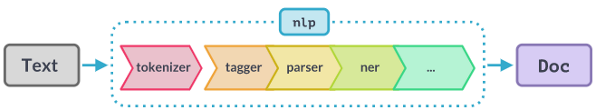

# Natural Language Processing

<b>1. </b>Natural language processing (NLP) refers to a set of methods and tools used to work with text data.

The field is based on the fact that language, as you might have noted, is not random: we use different words in 
frequencies that are meaningful, and in accordance with a syntax that makes these words obey a number of rules.

For instance, <a href="https://en.wikipedia.org/wiki/Zipf%27s_law">Zipf's Law</a> is 
seemingly true, so far, of every natural language; once you know this, you can, e.g., identify words that depart 
from the average, for instance to identify topics, or even forgeries (e.g., like tax authorities - in theory - make use of <a href="https://en.wikipedia. org/wiki/Benford%27s_law">Benford's Law</a> to track fraud).

Now, one of the fields's basic ideas is that words and concepts can be reduced to vectors, which then allow them to 
be compared with each other - but also to find similarities. (In this respect, I recommend 
this <a href="https://www.newyorker.com/magazine/2021/12/06/the-science-of-mind-reading">New Yorker article</a> which explains the greater picture here, as the same intuition powers attempts to read the brain of paralysed individuals, for instance)

<b>2. </b> Don't worry, you don't need to go deep into the mathematics of it all to use NLP, however. As often with 
Python, someone has already done most of the work for you.

That includes actually preparing datasets and ways to analyse text that cuts to the chase. As mentioned, language 
follow some rules, but that leaves quite a lot of variety, and you wouldn't go very far if your script thinks that 
two versions of the same conjugated verb represent totally different words. Words are also polysemic, and you need 
Python to understand that a "fly" is different from the verb "to fly". Also, how do you recognise words that are not 
in a standard dictionary, or even names ?

<b>3. </b> All this is why tools in this space typically attempt to provide the following functions:

<ul><li><b>Tokenizer</b> We want to reduce words to tokens with a fixed meaning; this often involves</li>
<ol><i>stemmization</i>, the process of finding the "root" of a word that gets inflected; and</ol>
<ol><i>lemmatisation</i>, the process of attaching words that go together to a single lemma (this is harder and 
requires pre-existing data); and</ol>
<ol><i>stop-words</i> often need to be removed: these are the "the", "and", punctuations, etc., that in most cases 
are not meaningful for the analysis (though could be for some: for instance, stylometry).</ol>
    <li><b>Part of Speech (POS) tagging</b>, i.e., identifying subjects, verbs, etc.</li>
    <li><b>Chunking</b>, to identify parts of a text that necessarily go together, like verbs with split 
auxiliaries; or names like "Damien Charlotin"</li>
    <li><b>Named Entities Recognition</b>, to distinguish names from the rest of a text, but also to assign a value 
to these names (organisation, proper name, brand, etc.).</li>
    </ul>

<b>4. </b>In what follows, we'll use the module `spacy`, which does all that, including for French. (A more legacy, 
yet good alternative is `nltk`, which has modules specific to French as well). Go <a href="https://spacy. io/usage">here</a> to check how to import spacy and the language model.

Spacy processes documents and texts according to a pipeline: first finding the tokens, then their roots, then their place in a sentence, etc.

We'll do it over a dataset of articles from the Code civil to check who were the main subjects of the law at the time, and who are they now.

<b>5. </b>But first a few words as to `spacy`: you first need to load the language module in an object (here called nlp), and from that object you use functions related to a text. The main function is to transform some text in a token or a list of tokens.

The reason why we use already-collected language models is that they are already "smart": they know what words refer 
to in general (though maybe not in the context of a subdomain, such as law). Usually, this is done by ingesting 
loads of text, and identifying words that go together, to get a sense of the distance between two words: if two 
distinct words are often used interchangeable in a given context, they are probably synonyms, for instance. Doing 
this you obtain vectors that gives you an approximation of a word's position in the vocabulary space. (This is 
called word-embedding, and you can lear more about it <a href="https://www.analyticsvidhya.com/blog/2020/08/top-4-sentence-embedding-techniques-using-python/">here</a>, or <a href="https://penseeartificielle.fr/methode-google-comprendre-sens-mots-word-embedding-python-gensim/">here</a>)

But here is the most common example: using the word "roi", we can try to identify what's the closest approximation 
of "roi" once we substract "homme" and add "femme" (works only with larger French model).

<b>6. </b> Vectors (and similarities) are fun, but mostly you'll be interested in spacy's power 
to detect what's a subject, a stop word, etc. A few attributes found in spacy tokens are essential here:
<ul><li><b>pos_</b>Which is the part of speech (think verb, nouns, etc.)</li>
<li><b>dep_</b>, which is the relation of a given word with the structure of a sentence, to distinguish a subject 
from an object, by instance; and</li>
<li><b>morph</b> Which gives you a number of additional data point about a token, such as gender, number, and 
conjugation; and</li>
    </ul>

Besides, spacy has a number of booleans inserted into tokens, which you can query with attributes such as `.
is_punct` (True if punctuation, False otherwise), `is_stop` (True if stop word, False otherwise), etc.

<b>7. </b>A first thing we can do is to curate the text, then look at the most common words, depending on the year of the 
version of the code civil.

<u>Exercise</u> Based on what you just learned, find the 15 most common subjects in the Code civil for each year 
between 1980 and 2020.
