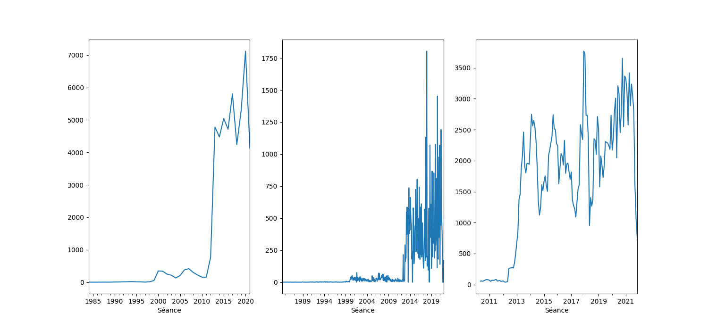
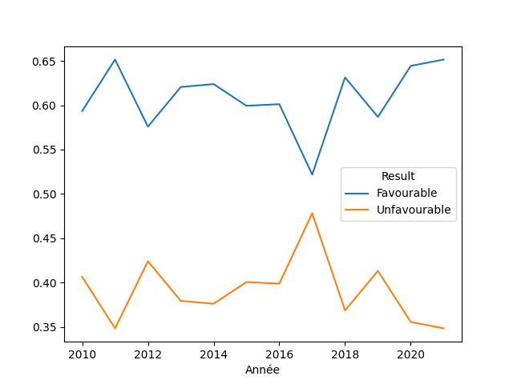
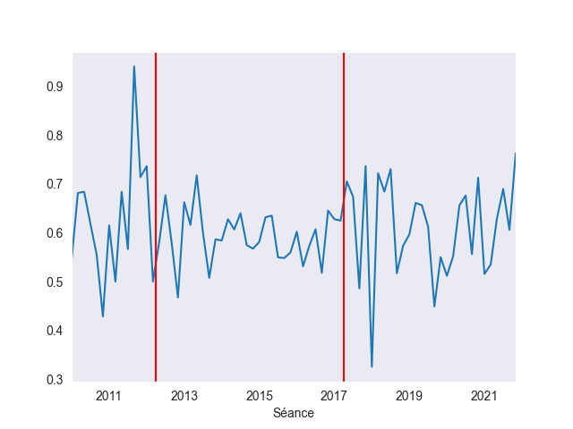

# Datasets

## Explore a dataset

Let's turn to an existing dataset, which you can find on data.gouv.fr. <a href="https://www.data.gouv.fr/fr/datasets/avis-et-conseils-de-la-cada/">here</a>.

This is a heavy file - we'll downsize it a bit later -, which collects all decisions by the CADA since its creation until May 2022, nearly 50,000 in total. We'll clean and perform basic analyses of this file, so as to answer a very simple and distinctive question: is the rate of positive/negative decisions by the CADA influenced by elections ?

(I recommend <a href="https://www.python-graph-gallery.com/cheat-sheets/">these cheatsheets</a> for everything we'll be learning in this and the next two parts.)

CSV cells, when opened in the MSExcel software, have a character limit (exactly 32,767 for a single cell, the same as an Excel, although the latter also have row and columns limits), and it's quite frequent that this is exceeded when dealing with texts. 

Sure enough, this one has an error at some point, which is clearly visible when you open the file on MSExcel.


This is not, however, an issue with pandas in this case (sometimes it can be, which would require you to clean the dataset first - for instance by removing lines that do not follow the normal structure of starting with a number ID, or lines where some columns are not properly filled in, etc.).

We can perform a tiny bit of data analysis already at this stage, looking at the type of data per column, or some basic description for our numerical columns.


```python
2+2
import numpy as np
import pandas as pd

df = pd.read_csv("LDA/Data/CSVs/cada-2023-01-02.csv", header="infer", encoding="utf8")
df = df.fillna("") # A lot of the manipulation we'll do won't work if the dataframe has too many "N/A" values - 
# and so we specify that all these empty values are actually empty strings
print(len(df))  # We check how long the dataframe is
print("___________")
print(df.head(15))  # We check that it is well-loaded by printing the top 15 rows
print("___________")
df.describe()
```

    49651
    ___________
       Numéro de dossier                                     Administration  \
    0         19840002.0                             ministre de la défense   
    1         19840003.0                             ministre de la défense   
    2         19850001.0  ministre de l'économie, des finances et du budget   
    3         19860001.0  directeur départemental du travail et de l'emp...   
    4         19870061.0                  gouverneur de la Banque de France   
    5         19870380.0  directeur de la caisse régionale d'assurance m...   
    6         19881774.0                       directeur général des impôts   
    7         19881993.0                            ministre de l'intérieur   
    8         19890099.0  ministre de l'intérieur (direction de la logis...   
    9         19890845.0  ministre de la justice (direction de l'adminis...   
    10        19900254.0                                 maire de Dunkerque   
    11        19900695.0  chef de l'inspection générale des affaires soc...   
    12        19900868.0     Président du conseil général de la Haute-Corse   
    13        19901565.0           Président de l'Ecole privée Saint-Joseph   
    14        19901932.0  directeur de la caisse d'allocations familiale...   
    
           Type   Année      Séance  \
    0      Avis  1984.0  03/03/1984   
    1      Avis  1984.0  13/12/1984   
    2      Avis  1985.0  05/12/1985   
    3   Conseil  1986.0  30/01/1986   
    4      Avis  1987.0  02/04/1987   
    5      Avis  1987.0  30/04/1987   
    6      Avis  1988.0  24/11/1988   
    7      Avis  1988.0  22/12/1988   
    8      Avis  1989.0  19/01/1989   
    9   Conseil  1989.0  18/05/1989   
    10  Conseil  1990.0  08/02/1990   
    11     Avis  1990.0  10/05/1990   
    12  Conseil  1990.0  23/05/1990   
    13     Avis  1990.0  27/09/1990   
    14     Avis  1990.0  22/11/1990   
    
                                                    Objet  \
    0                                         [Voir avis]   
    1                                         [Voir avis]   
    2                                         [Voir avis]   
    3                                         (voir avis)   
    4                                         [Voir avis]   
    5                                         [Voir avis]   
    6                                         (voir avis)   
    7                                         [Voir avis]   
    8   - instructions, circulaires et guides opérateu...   
    9   - "tableau de service" du centre de détention ...   
    10  - liste des personnels handicapés employés par...   
    11  - dossier déposé par Monsieur G. pour le trans...   
    12  - communication à un tiers de l'arrêté radiant...   
    13  - budget de l'école privée Saint-Joseph pour l...   
    14  - lettre émanant de Mme C. figurant au dossier...   
    
                                      Thème et sous thème  \
    0   Justice, Ordre Public Et Sécurité/Défense Et D...   
    1   Economie, Industrie, Agriculture/Secteurs Écon...   
    2   Justice, Ordre Public Et Sécurité/Association,...   
    3                  Travail Et Emploi/Droit Du Travail   
    4   Economie, Industrie, Agriculture/Secteurs Écon...   
    5   Affaires Sanitaires Et Sociales/Solidarités Et...   
    6   Finances Publiques Et Fiscalité/Contrôle Fisca...   
    7   Justice, Ordre Public Et Sécurité/Sécurité Civ...   
    8   Justice, Ordre Public Et Sécurité/Sécurité Civ...   
    9   Travail Et Emploi/Emploi Public, Justice, Ordr...   
    10                    Travail Et Emploi/Emploi Public   
    11  Affaires Sanitaires Et Sociales/Santé Publique...   
    12                    Travail Et Emploi/Emploi Public   
    13  Enseignement, Culture, Loisirs/Enseignement Sc...   
    14  Affaires Sanitaires Et Sociales/Solidarités Et...   
    
                                      Mots clés  \
    0                                     Armée   
    1                                     Armée   
    2                                             
    3       Licenciement, Conditions de travail   
    4                     Banques et assurances   
    5   Sécurité sociale, Conditions de travail   
    6                                             
    7               Politique et réglementation   
    8               Politique et réglementation   
    9              Carrière, Lieux de détention   
    10                          Carrière, Santé   
    11                               Médicament   
    12                 Territoriale, Discipline   
    13                                            
    14                         Sécurité sociale   
    
                                       Sens et motivation Partie  \
    0                                 Défavorable/Défense    III   
    1   Irrecevable/Imprécise, Défavorable/Défense, In...    III   
    2                                         Défavorable    III   
    3                   Défavorable/Procédure, Sans objet    III   
    4   Défavorable/Sécurité publique, Favorable/Sauf ...    III   
    5                                  Défavorable/Secret    III   
    6                               Défavorable/Procédure    III   
    7                     Défavorable/Abusive, Sans objet    III   
    8                                           Favorable    III   
    9                       Défavorable/Sécurité publique     II   
    10                             Défavorable/Vie privée     II   
    11               Favorable/Sauf commercial industriel     II   
    12                                          Favorable     II   
    13                                          Favorable    III   
    14                                          Favorable     II   
    
                                                     Avis  
    0   La commission d'accès aux documents administra...  
    1   La commission d'accès aux documents administra...  
    2   La commission d'accès aux documents administra...  
    3   La commission d'accès aux documents administra...  
    4   La commission d'accès aux documents administra...  
    5   La commission d'accès aux documents administra...  
    6   La commission d'accès aux documents administra...  
    7   La commission d'accès aux documents administra...  
    8   La commission d'accès aux documents administra...  
    9   La commission d'accès aux documents administra...  
    10  communication de la liste des personnels handi...  
    11  La commission d'accès aux documents administra...  
    12  La commission d'accès aux documents administra...  
    13  La commission d'accès aux documents administra...  
    14  favorable à la communication à Mme C., par vou...  
    ___________


<div>
<style scoped>
    .dataframe tbody tr th:only-of-type {
        vertical-align: middle;
    }

    .dataframe tbody tr th {
        vertical-align: top;
    }

    .dataframe thead th {
        text-align: right;
    }
</style>
<table border="1" class="dataframe">
  <thead>
    <tr style="text-align: right;">
      <th></th>
      <th>Numéro de dossier</th>
      <th>Administration</th>
      <th>Type</th>
      <th>Année</th>
      <th>Séance</th>
      <th>Objet</th>
      <th>Thème et sous thème</th>
      <th>Mots clés</th>
      <th>Sens et motivation</th>
      <th>Partie</th>
      <th>Avis</th>
    </tr>
  </thead>
  <tbody>
    <tr>
      <th>count</th>
      <td>49651</td>
      <td>49651</td>
      <td>49651</td>
      <td>49651</td>
      <td>49651</td>
      <td>49651</td>
      <td>49651</td>
      <td>49651</td>
      <td>49651</td>
      <td>49651</td>
      <td>49651</td>
    </tr>
    <tr>
      <th>unique</th>
      <td>3047</td>
      <td>2448</td>
      <td>4</td>
      <td>28</td>
      <td>359</td>
      <td>2953</td>
      <td>621</td>
      <td>461</td>
      <td>345</td>
      <td>4</td>
      <td>3046</td>
    </tr>
    <tr>
      <th>top</th>
      <td></td>
      <td></td>
      <td></td>
      <td></td>
      <td></td>
      <td></td>
      <td></td>
      <td></td>
      <td></td>
      <td></td>
      <td></td>
    </tr>
    <tr>
      <th>freq</th>
      <td>46605</td>
      <td>46605</td>
      <td>46605</td>
      <td>46605</td>
      <td>46605</td>
      <td>46615</td>
      <td>46605</td>
      <td>47486</td>
      <td>46609</td>
      <td>46606</td>
      <td>46605</td>
    </tr>
  </tbody>
</table>
</div>


A dataframe is a very powerful tool to analyse and extract insights from a dataset. 

For instance, one question you migh ask is: what are the types of decisions in the dataset. In other words,  what's the distribution ? The `value_counts` method is particularly helpful here, especially when you normalise the data to have percentages.


```python
print(df.Type.value_counts(normalize=True))  # We can also multiply by * 100 to get proper percentages
df.groupby("Année").size().plot()  # We group by years, and then use plot the have an idea of the distribution
```

    Avis        0.665463
    Conseil     0.334209
    Sanction    0.000328
    Name: Type, dtype: float64


    <AxesSubplot:xlabel='Année'>


    

    


```python
df.Année.hist(bins=20)  # Another approach is to use an histogram, with all years divided into x bins

df.groupby("Année").Type.value_counts().unstack(level=0)   
# We combine both tools to get a broader type of chart, and then we unstack
```


<div>
<style scoped>
    .dataframe tbody tr th:only-of-type {
        vertical-align: middle;
    }

    .dataframe tbody tr th {
        vertical-align: top;
    }

    .dataframe thead th {
        text-align: right;
    }
</style>
<table border="1" class="dataframe">
  <thead>
    <tr style="text-align: right;">
      <th>Année</th>
      <th>1984.0</th>
      <th>1985.0</th>
      <th>1986.0</th>
      <th>1987.0</th>
      <th>1988.0</th>
      <th>1989.0</th>
      <th>1990.0</th>
      <th>1991.0</th>
      <th>1992.0</th>
      <th>1993.0</th>
      <th>...</th>
      <th>2001.0</th>
      <th>2002.0</th>
      <th>2003.0</th>
      <th>2004.0</th>
      <th>2005.0</th>
      <th>2006.0</th>
      <th>2007.0</th>
      <th>2008.0</th>
      <th>2009.0</th>
      <th>2010.0</th>
    </tr>
    <tr>
      <th>Type</th>
      <th></th>
      <th></th>
      <th></th>
      <th></th>
      <th></th>
      <th></th>
      <th></th>
      <th></th>
      <th></th>
      <th></th>
      <th></th>
      <th></th>
      <th></th>
      <th></th>
      <th></th>
      <th></th>
      <th></th>
      <th></th>
      <th></th>
      <th></th>
      <th></th>
    </tr>
  </thead>
  <tbody>
    <tr>
      <th>Avis</th>
      <td>2.0</td>
      <td>1.0</td>
      <td>NaN</td>
      <td>2.0</td>
      <td>2.0</td>
      <td>1.0</td>
      <td>3.0</td>
      <td>4.0</td>
      <td>6.0</td>
      <td>6.0</td>
      <td>...</td>
      <td>228.0</td>
      <td>149.0</td>
      <td>114.0</td>
      <td>82.0</td>
      <td>115.0</td>
      <td>236.0</td>
      <td>295.0</td>
      <td>241.0</td>
      <td>162.0</td>
      <td>74.0</td>
    </tr>
    <tr>
      <th>Conseil</th>
      <td>NaN</td>
      <td>NaN</td>
      <td>1.0</td>
      <td>NaN</td>
      <td>NaN</td>
      <td>1.0</td>
      <td>2.0</td>
      <td>2.0</td>
      <td>5.0</td>
      <td>8.0</td>
      <td>...</td>
      <td>111.0</td>
      <td>100.0</td>
      <td>100.0</td>
      <td>48.0</td>
      <td>91.0</td>
      <td>143.0</td>
      <td>121.0</td>
      <td>60.0</td>
      <td>60.0</td>
      <td>20.0</td>
    </tr>
    <tr>
      <th>Sanction</th>
      <td>NaN</td>
      <td>NaN</td>
      <td>NaN</td>
      <td>NaN</td>
      <td>NaN</td>
      <td>NaN</td>
      <td>NaN</td>
      <td>NaN</td>
      <td>NaN</td>
      <td>NaN</td>
      <td>...</td>
      <td>NaN</td>
      <td>NaN</td>
      <td>NaN</td>
      <td>NaN</td>
      <td>NaN</td>
      <td>NaN</td>
      <td>NaN</td>
      <td>1.0</td>
      <td>NaN</td>
      <td>NaN</td>
    </tr>
  </tbody>
</table>
<p>3 rows × 27 columns</p>
</div>


    

    


Another question, since we have the Years, is to check the chronological evolution of the number of decisions. Here as well, we could use `value_counts`, but it's sometimes easier to group the dataframe by a data point (here, years) and then find out the size of every group.

This is where the module `pyplot` becomes useful and relevant. Shortly put, while `pandas` allows you to make basic plots, you often need other modules to fine-tune those plots. Pyplot provides the basics for this: the logic is that your plot is located in a `plt` element, which comes with a number of methods to act upon, e.g., the axes, the grid, colors, etc.

Another popular module in this context is `seaborn`, often abbreviated `sns`, which provides a number of ready-to-use graphs functions. This can also be used in parallel with pyplot and the basic plot tools of `pandas`. 


```python
import matplotlib.pyplot as plt # This is a standard plotting module

df.index = pd.to_datetime(df.Séance)  # To analyse time series, your dataframe should be indexed chronologically, 
# which you can do by replacing the index with this function that creates datetime objects from a column with dates
plt.figure(figsize=(15,7))  # To manage the following graphs, we initialise an empty plot
plt.subplot(131) # Then in that subplot we indicate that we want to have a suplot at that index
df.resample("1Y").size().plot()  # The method "resample" is equivalent to the groupby above, though it works on the index; 
# since the index are dates,  you can resample by quarters, month, etc.
plt.subplot(132)
df.resample("1M").size().plot()
df = df["2010-01-01":"2023-01-01"]  # Data before 2010 is not very relevant, let's cut it out by indexing
x = df.resample("1M", convention="start").size()  
xroll = x.rolling(5).sum() # Let's get a rolling average to get thing in better perspective
plt.subplot(133)
xroll.plot()
```

    /tmp/ipykernel_4/2379116511.py:11: FutureWarning: Value based partial slicing on non-monotonic DatetimeIndexes with non-existing keys is deprecated and will raise a KeyError in a future Version.
      df = df["2010-01-01":"2023-01-01"]  # Data before 2010 is not very relevant, let's cut it out by indexing


    <AxesSubplot:xlabel='Séance'>


    

    


You can also be interested in locating specific items in the dataset. Here, `pandas` offers you plenty of ways to pinpoint a specific row, or colums, or cell - though it's not always intuitive. Once again, having an idea of the type of output will really help you understand how to manipulate all these. For instance, `.iloc` returns a row, while `.loc` returns another, smaller dataframe. `.at` returns a cell, because you need to specify both an index (row) and a column.


```python
print(df.iloc[10])  # Compared to your Excel, pandas are shifted two indexes below, to account for 1. the headers, and 
# 2. the fact that Python indexes start at 0
print("_______________")
print(df.loc[df.Année == "2010"])  # You specify a condition, and then obtain a smaller dataframe if you do not care for 
# a particular column; notice that the type is important. 
# Use the tilde ~ to specify a negative condition df.loc[~(XX) & (XX)]
print("_______________")
print(df.loc[df.Année == 2010][["Type", "Objet"]])  # You get more than one columns by using a double list
```

    Numéro de dossier                                             20100369.0
    Administration         inspecteur d'académie, directeur des services ...
    Type                                                                Avis
    Année                                                             2010.0
    Séance                                                        28/01/2010
    Objet                  La communication du fichier numérique de l'ens...
    Thème et sous thème                      Travail Et Emploi/Emploi Public
    Mots clés                                                       Carrière
    Sens et motivation                             Favorable/Sauf vie privée
    Partie                                                               III
    Avis                   La secrétaire générale du SGEN-CFDT Midi-Pyrén...
    Name: 2010-01-28 00:00:00, dtype: object
    _______________
    Empty DataFrame
    Columns: [Numéro de dossier, Administration, Type, Année, Séance, Objet, Thème et sous thème, Mots clés, Sens et motivation, Partie, Avis]
    Index: []
    _______________
                   Type                                              Objet
    Séance                                                                
    2010-01-14     Avis  - la mise en ligne sur le site internet de son...
    2010-01-14     Avis  - la copie, en sa qualité de tutrice de son pe...
    2010-01-14     Avis  - copie, sans occultation, des bordereaux d'en...
    2010-01-14     Avis  - la copie des factures d'eau des abonnés, aut...
    2010-01-14     Avis  - copie du jugement par lequel la salle du pre...
    ...             ...                                                ...
    2010-09-23     Avis  - la communication du dossier médical de sa fi...
    2010-09-09     Avis  - communication des procès-verbaux des réunion...
    2010-09-09  Conseil  - caractère communicable, à la nièce et au nev...
    2010-09-09     Avis                                             #NAME?
    2010-07-27     Avis  - communication et réutilisation, par leur cli...
    
    [94 rows x 2 columns]


## Synthetise Data

Your analyses will be more powerful if you are able to synthetise the data in the dataset.

For instance, when you look at the different results recorded in the `Sens et motivation` column, you can see that the categories are not super helpful. It'd be better to group them in two categories: favourable, and unfavourable (counting instances of "Incompétent", "Inexistant", etc. as unfavourable).

We might also want to group the different sorts of administrations, but this is harder, as they are many more categories. We can do a process of iterating through these until most have been tagged one way or another, and be happy with leaving the "Other" on the side.


```python
import regex as re

print(df["Sens et motivation"].value_counts()) 

df["Result"] = ""  # We want to create a column that gives us the result, there are several ways to do it

for index, row in df.iterrows():  # One way would be to iterate over each row and check that the condition is met
    if re.search("défavorable", row["Sens et motivation"], re.S | re.I):  
        # Note that we start with défavorable, because the term contains "favorable" in it, which could confuse the regex search
        df.at[index, "Result"] = "Unfavourable"
    elif re.search("favorable", row["Sens et motivation"], re.S | re.I):
        df.at[index, "Result"] = "Favourable"
    else:
        df.at[index, "Result"] = "Unfavourable"
```

    Favorable                                                                                                                  31
    Favorable/Sauf vie privée                                                                                                   7
    Défavorable/Vie privée                                                                                                      7
    Défavorable/Secret                                                                                                          5
    Incompétence/Judiciaire                                                                                                     3
    Favorable/Sauf commercial industriel                                                                                        3
    Défavorable/Vie privée, Favorable                                                                                           3
    Sans objet/Inexistant, Favorable                                                                                            3
    Incompétence/Loi spéciale                                                                                                   3
    Incompétence/Privé                                                                                                          2
    Incompétence/Juridictionnel, Favorable                                                                                      2
    Irrecevable                                                                                                                 2
    Défavorable                                                                                                                 1
    Défavorable/Secret, Favorable                                                                                               1
    Irrecevable/Hors champ                                                                                                      1
    Irrecevable/Hors champ, Incompétence/Judiciaire, Favorable/Sauf défense, Favorable/Sauf secret, Favorable/Sauf sécurité     1
    Incompétence/Renseignement, Favorable/Sauf vie privée                                                                       1
    Incompétence/Juridictionnel                                                                                                 1
    Défavorable/Article 4                                                                                                       1
    Favorable/Sauf comportement, Favorable/Sauf vie privée, Favorable/Sauf appréciation                                         1
    Incompétence/Renseignement, Favorable                                                                                       1
    Favorable/Sauf commercial industriel, Favorable/Sauf vie privée                                                             1
    Défavorable/Secret, Défavorable/Vie privée                                                                                  1
    Favorable/Sauf vie privée, Favorable/Sauf comportement                                                                      1
    Défavorable, Sans objet/Inexistant, Favorable                                                                               1
    Sans objet/Inexistant, Incompétence/Privé, Favorable/Sauf commercial industriel                                             1
    Favorable/Sauf vie privée, Favorable/Si mandat (favorable si vous produisez un mandat de la personne concernée)             1
    Défavorable/Préparatoire                                                                                                    1
    Défavorable/Appréciation, Favorable/Sauf vie privée                                                                         1
    Défavorable/Sécurité publique                                                                                               1
    Défavorable, Favorable                                                                                                      1
    Défavorable/Sécurité publique, Favorable/Sauf sécurité                                                                      1
    Irrecevable/Hors champ, Favorable                                                                                           1
    Sans objet/Inexistant, Incompétence/Juridictionnel                                                                          1
    Incompétence/CNIL                                                                                                           1
    Name: Sens et motivation, dtype: int64


```python
def resultsearch(value):  # A second way would be to use function that will do the same,
    # and apply it to the dataframe with ".apply"
    if re.search("défavorable", value, re.S|re.I):
        return "Unfavourable"
    elif re.search("favorable", value, re.S|re.I):
        return "Favourable"
    else:
        return "Unfavourable"

df["Result"] = df["Sens et motivation"].apply(lambda x: resultsearch(x))  
# This allows you to apply a function to a value, which is represented by "x" here
```


```python
print(df.Result.value_counts(normalize=True) * 100)  # We obtain percent of favourable decisions
print("_______________")
df.groupby("Année").Result.value_counts(normalize=True).unstack().plot()  
# And then we plot it. See that the low number of entries for earlier years makes it harder to draw conclusions.
```

    Favourable      58.510638
    Unfavourable    41.489362
    Name: Result, dtype: float64


    <AxesSubplot:xlabel='Année'>


    

    


To further answer the question about the number of decisions around the elections, we will also need to synthetise the "Administration" column - which, like "Sens et motivation", has too many different values to be useful.


```python
print("There are ", df["Administration"].nunique(), " different values for Administration in the dataset...")


dict_admin = {"[Mm]airie": "Municipal", "[Rr]égion": "Regional", "[dD]epartment": "Department",
        "[Mm]inist|[Pp]réfec?t": "Central"}  # We create a that will link some regexes to synthetise values. For instance, 
# we can expect that all values having the term "[Mm]inist" pertain to the central administration

def apply_type(value): # The function will loop over the dict's keys 
    for key in dict_admin:
        if re.search(key, value.strip(), re.S | re.I):
            return dict_admin[key]
    return "Other"

df["Admin"] = df.Administration.astype(str).apply(lambda x: apply_type(x)) # We apply the function to the Administration column,
# creating a new "Admin" column with synthetised value
print(df.Admin.value_counts()) # And now we check how many rows we managed to synthetise - e.g., how many "Other" remain
print("_______________")

# Since there are still many "Other", we return to the data to check what they refer to in general, trying to find 
# Further rules to add to our dictionary
print(df.loc[df.Admin == "Other"].Administration.value_counts()[:20])  
# Locating with Python using a condition. You'll note for instance that acronymes with a number are often departemental
# admins, whereas the use of the term "national" indicate central administration
```

    There are  93  different values for Administration in the dataset...
    Other       69
    Central     19
    Regional     6
    Name: Admin, dtype: int64
    _______________
    maire de Saint-Cyr-l'Ecole                                                                                   1
    directrice générale du groupement d'intérêt public enfance en danger (GIPED)                                 1
    directeur du centre interdépartemental de la viticulture                                                     1
    président de la communauté urbaine de Dunkerque                                                              1
    présidente de l'université Paul-Valéry Montpellier III                                                       1
    directeur départemental des territoires de la Haute-Vienne (service eau, environnement, forêt et risques)    1
    directeur du GIE SESAM-Vitale                                                                                1
    directeur de l'Agence française de sécurité sanitaire des produits de santé (AFSSAPS)                        1
    maire de Fontainebleau                                                                                       1
    directeur général de l'opéra de Rouen - Haute-Normandie                                                      1
    président du tribunal de grande instance de Paris                                                            1
    maire d'Antony                                                                                               1
    directeur du service départemental d'incendie et de secours des Alpes-Maritimes                              1
    maire de Villeneuve-Saint-Georges                                                                            1
    président du syndicat mixte du bassin versant du Lez                                                         1
    maire de Clichy-la-Garenne                                                                                   1
    responsable du centre d'études et de conservation des oeufs et du sperme (CECOS) Jean Verdier                1
    maire de Rennes                                                                                              1
    président de la ligue de Franche-Comté de ball-trap et tir à balle                                           1
    maire de Fontenay-sous-Bois                                                                                  1
    Name: Administration, dtype: int64


```python
dict_admin = {"[Mm]airie|agglom|commune": "Municipal", "[Rr]égion": "Regional", "[dD]epartment|\d\d\)?$": "Department",
        "[Mm]inist|[Pp]réfec?t|[Ddirection [Gg]énérale|[Nn]ational|[Ff]rançais|[Uu]niversit|[A-Z-]+\)?$": "Central"}
# We add these new rules and terms to our regex, and redo the process

df["Admin"] = df.Administration.astype(str).apply(lambda x: apply_type(x))  # We reapply with broader dict

print(df.Admin.value_counts())  # If the number of others is negligible, we consider that the job is done
```

    Other         46623
    Central        2819
    Regional        130
    Municipal        73
    Department        6
    Name: Admin, dtype: int64


```python
sns.set_style("dark")  # Change style of plots with sns
sns.countplot(x="Admin", hue="Result", data=df)   # Seaborn has great plot types such as this simple countplot

```


    <AxesSubplot:xlabel='Admin', ylabel='count'>


    

    


## Analyses

One of the easiest analyses you could make is to check if the differences in your data are statistically relevant. Here, it seems that it is harder to get a document from a central administration than from a regional or departmental administration. But are the differences in the rates of success over the years truly statistically different ? 

To investigate this, we can do a t-test, which checks if two groups of data are from the same population (which means they would have a similar mean).
(In theory, a t-test does not work well in these circumstances since the samples do not necessarily follow a normal distribution and their variance differs. But this is just for the demonstration.)


```python
df.groupby("Admin").Result.value_counts(normalize=True).unstack()  
# As you can see, it's a bit harder to get a document from a Central administration,
# and a bit easier to get them from municipalities

cent_fav_per_year = df.groupby(["Année", "Admin"]).Result.value_counts(normalize=True).unstack()[
    "Favourable"].unstack()["Central"] # We extract a Series with the percent of unfav decisions over the years for both the
# Central and Regional administrations
reg_fav_per_year = df.groupby(["Année", "Admin"]).Result.value_counts(normalize=True).unstack()[
    "Unfavourable"].unstack()["Regional"]  
print(cent_fav_per_year.dropna())

from scipy import stats # a statistics module

stats.ttest_ind(cent_fav_per_year.dropna().values.tolist(), reg_fav_per_year.dropna().values.tolist(), equal_var=False)
# The t-test function takes only lists of numbers, so we drop the "N/A" values and convert series to lists
# Since the p-value is above 0.5, we cannot conclude that the samples are that different
```

    Année
    1989.0    0.500000
    1990.0    0.800000
    1991.0    0.400000
    1992.0    0.727273
    1993.0    0.571429
    1994.0    0.411765
    1995.0    0.666667
    1996.0    0.428571
    1997.0    0.333333
    1998.0    0.600000
    1999.0    0.608696
    2000.0    0.643750
    2001.0    0.643750
    2002.0    0.578947
    2003.0    0.596859
    2004.0    0.595041
    2005.0    0.520833
    2006.0    0.611594
    2007.0    0.524051
    2008.0    0.588448
    2009.0    0.581731
    2010.0    0.569767
    Name: Central, dtype: float64


    Ttest_indResult(statistic=0.6256064491382229, pvalue=0.5391764109107897)


Now, once we have done all this, we can check one of the first questions we had: does the CADA slows down before elections take place ?

One way to look at it is simply to plot the number of decisions, and indicate the relevant election (Présidentielle for the Central administration, etc.) with a line. Doing this, it's hard to detect a role for elections in the rate of favourable opinions from the CADA, although it seems that the number of decisions decreases as election approaches.


```python
ax = df.loc[df.Admin == "Central"].resample("2M").Result.value_counts(normalize=True).unstack()["Favourable"].plot()   
# Next we look at the number of decisions per month, focusing on Favourable results.
# We pass it to an object ax that will represent our plot
ax.axvline("2022-04-23", color="red")  # We add a line to indicate the presidential elections' rough date
ax.axvline("2017-04-23", color="red") 
ax.axvline("2012-04-23", color="red") 
```


    <matplotlib.lines.Line2D at 0x7f7258f32040>


    

    


```python
df.loc[df.Admin == "Department"].resample("1M").Result.value_counts(normalize=True).unstack()["Favourable"].plot()    
# Now the same for departmental elections
plt.axvline("2021-06-29", color="red")
plt.axvline("2015-03-29", color="red")
```


    <matplotlib.lines.Line2D at 0x7f7258e26f70>


    

    


```python
df.loc[df.Admin == "Regional"].resample("2M").Result.value_counts(normalize=True).unstack()["Favourable"].plot()    
# Now the same for regional elections
plt.axvline("2021-06-29", color="red")
plt.axvline("2015-12-10", color="red")
```


    <matplotlib.lines.Line2D at 0x7f7258d00fd0>


    

    


Therefore, we see little evidence that favourable decisions drop before an election.

A second Analysis we could do is to track the average length of time it takes the CADA to issue a decision (which, in theory, should issue a decision at most one month after a saisine).

To do this, we first need to extract the date of Saisine from the CADA's decisions.


```python
df["Séance"]
```


    Séance
    2010-01-14    14/01/2010
    2010-01-14    14/01/2010
    2010-01-14    14/01/2010
    2010-01-14    14/01/2010
    2010-01-14    14/01/2010
                     ...    
    2010-09-23    23/09/2010
    2010-09-09    09/09/2010
    2010-09-09    09/09/2010
    2010-09-09    09/09/2010
    2010-07-27    27/07/2010
    Name: Séance, Length: 94, dtype: object


```python
# Second analysis: the average length to get a CADA decision

import locale
locale.setlocale(locale.LC_ALL, "fr_FR")  # Depending on your OS, you may not be set to work with French data and format - 
# such as dates - so we first need to set that

df["Séance"] = pd.to_datetime(df["Séance"], format="%d/%m/%Y")
df["Saisine"] = df.Avis.astype(str).str.extract("(\d\d? [a-z]+ \d{4})")  
# We create a new column by looking into the text of the avis and extracting a date with a regex pattern

print(df.Saisine.value_counts())  # We check, and this is not ideal, many false dates have inserted themselves
df["Saisine"] = df.Avis.astype(str).str.extract("le (\d\d? [a-z]{3,} \d{4})")  
# One better way is to check for dates starting by "le", since most avis refer to a courrier "envoyé le"
print("______________")
print(df.Saisine.value_counts()) # This is better
```

    17 juillet 1978     8
    11 mars 2010        5
    10 juin 2010        3
    8 juillet 2010      3
    20 janvier 2010     3
                       ..
    16 mars 2010        1
    18 mars 2010        1
    25 novembre 2009    1
    31 mars 2010        1
    5 juillet 2010      1
    Name: Saisine, Length: 63, dtype: int64
    ______________
    10 juin 2010         3
    20 janvier 2010      3
    29 janvier 2010      2
    24 mars 2010         2
    22 mars 2010         2
    25 mai 2010          2
    10 mars 2010         2
    9 avril 2010         2
    14 juin 2010         2
    18 juin 2010         2
    30 novembre 2009     2
    19 janvier 2010      2
    25 juin 2010         1
    21 mai 2010          1
    20 avril 2010        1
    29 avril 2010        1
    30 avril 2010        1
    8 juillet 2010       1
    7 juillet 2010       1
    19 mai 2010          1
    6 juillet 2010       1
    16 juin 2010         1
    26 mai 2010          1
    30 juin 2010         1
    2 juin 2010          1
    4 juin 2010          1
    2 juillet 2010       1
    12 avril 2010        1
    31 mars 2010         1
    7 avril 2010         1
    8 avril 2010         1
    27 octobre 2009      1
    29 septembre 2005    1
    5 janvier 2010       1
    7 janvier 2010       1
    18 janvier 2010      1
    21 janvier 2010      1
    26 janvier 2010      1
    3 mars 2010          1
    29 septembre 2009    1
    5 mars 2010          1
    8 mars 2010          1
    9 mars 2010          1
    15 mars 2010         1
    16 mars 2010         1
    11 mars 2010         1
    18 mars 2010         1
    26 mars 2010         1
    25 novembre 2009     1
    2 avril 2010         1
    5 juillet 2010       1
    Name: Saisine, dtype: int64


```python
df["DateS"] = pd.to_datetime(df["Saisine"], format="%d %B %Y", errors="coerce")  
# Then we can convert the dates found to a datetime object; we "coerce" to ignore errors (wrong format, etc.)

df["Delta"] = df["Séance"] - df["DateS"]  # We obtain the delta between the two dates
df["Days"] = df.Delta.apply(lambda x: x.days)  
# And then fetch the number of days from the datetime values in the delta column. Again, the function apply allows
# you to work on the data in the columns immediately. Since the Delta data is datetime, we can get the .days attribute

df.loc[(df.Days > 0) & (df.Days < 300)].resample("3M").Days.mean().plot()  # Finally, we plot the results of our dataframe,
# removing outliers (negative deltas and deltas over 300 days)
```


    <AxesSubplot:xlabel='Séance'>


    <Figure size 432x288 with 1 Axes>


We observe the for a long time the delays were increasing very rapidly. Yet, something happened around 2020, which helped the CADA deal with applications much more quickly.
