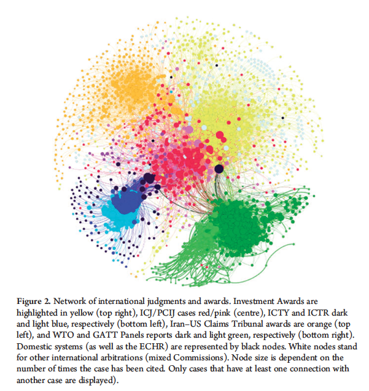

# Preparing the Dataset

<b>1. </b> Today's goal is to create, and analyse, a number of networks. 

Network Analysis refers to a set of methods to analyze and display the relationship (“ties”) between data points 
(“nodes”), and has emerged as a versatile analytical tool. This method is perhaps best known for its visualizations: ties connect nodes to produce spider webs that cluster the most connected nodes at its center. 

Aside from visualizing complex relationships, network analysis also comes with a set of useful metrics e.g., to measure the place of a node in a network (“centrality”), find groupings (“modularity”), or to assess the connectedness of networks (“density”). In addition, network science comes with concepts that can be applied across domains. For example, the idea of “preferential attachment” (i.e., nodes with a lot of ties are more likely to attract new ties than nodes with few ties) can in part help explain the frequent reappointments of star arbitrators or the continued reliance on old precedents.

<b>2. </b> But before doing all this, we need the data to create a network ! While network analysis is typically 
used to represent social connections (e.g., the arbitrators sitting on the same tribunal)  or document links (e.g., 
citations between investment awards), only creativity limits what can be represented as nodes and ties (for 
instance, check out this <a href="https://royalsocietypublishing.org/doi/10.1098/rsos.210617">cool paper</a> using 
network analysis to predict football matches).

Today we'll study a citation network from the French Code Civil. Individual articles will be the nodes, and 
citations or cross-references to other articles will be the ties. In addition, we'll collect some metadata about the 
nodes, such as the book or chapters they are included in.

But to do that, you first need to collect the data - those edges and nodes, and put them in a set. When you scraped 
Légifrance for the Code civil, you might have noticed that each article's page also offered you indications as to 
cited by/cite to, which we could use, although it's time-consuming to scrap. Instead, we'll just create our network from plain-text.

Do note however that there are plenty of ways to refer to other articles; besides, it's quite frequent for the Code 
civil to refer to other codes as well, or to laws that are not codified yet, so you need to provide for this.

<b>3. </b> Now that we have our nodes and edges, it's time to create a network, and analyse it.

(Note that there are third-party softwares, such as Gephi, or Visone, which are better for these purposes than pure 
Pythonic approaches, but this will do for now.)

<b>4. </b>First, we start with our lists of nodes and edges, which were prepared for NetworkX - Python's main 
network module. We initialise a graph with this data, and look at basic info from the graph.

So, there are far fewer edges than nodes, meaning that articles don't cite much other articles - or at least, not 
articles from the Code civil. Average degree is, accordingly, low: nodes that cite have on average 0.5 connections 
with other nodes. Note, however, that this depends on our definition of "connection", which here is based entirely 
on the express citations in articles. We could have created a network where sharing the same subsection means that 
articles are connected with each other.

Next we add attributes to our nodes, and notably the part of the Civil Code they come from.

<b>5. </b>This is when we come to the visualisation of the network, which is a whole thing in itself, as it allows 
us to know the structure of the dataset. Networks can be sparse or dense, concentred or not, centralised or 
decentralised, etc. In order to find this out, however, you need to tell your network algorithms what to do with the 
nodes: line them up one next to the other, with arrows linking them ? Or instead try to find a topology that makes 
more sense by approaching "close" nodes from each other ? There are many ways to operate.

Sadly, `networkX` is not great for visualisations. Which is not to say you can't do anything with `networkX`; here is 
one example. (It might take a while to render.)

<b>6. </b> On the other hand, `networkX` is great to calculate network measures, which are the next step of the 
analysis.

We can calculate the density of the network which is how many edges are there compared to the maximum possible 
number of edges. The Civil Code, in this respect, is quite sparse, i.e., little dense.

Then the diameter of a graph indicates, if you want, its size: how far from the nodes that are the furthest from one 
another ?

Finally, transitivity, which is the ratio of existing "triangles" or "triads" over the possible number. This 
indicates how close your network is, on the idea that the friend of a friend is often your friend. (I use this kind 
of triadic insights to find out investment arbitration tribunals that could be.)

<b>5. </b> After analysing the network in itself, it can be helpful to try to review the nodes, and notably: which 
are the most important ones ?

This is a question of centrality, and its answer is more complicated than "the node with the most connections" (also 
known as "Degree").

For instance a more interesting measure is called eigenvector centrality: this is the measure of a node's importance,
calculated from that node's number of degree, plus the degree of its neighbours. This is used in many modern 
algorithms that you commonly use.

This is to find important nodes, but sometimes you are more interested in "hubs": i.e., nodes that connect  two 
aspects of a network. For this, there is a measure called betweenness centrality. It is 
interesting to contrast this measure with degree: nodes with (relatively) low degree and high betweenness centrality 
can be seen as "gatekeepers".

Likewise, these measures can be compared with other measures: are the most important articles in the Civil Code also 
the longest (not necessarily) ? Are they the articles that were amended most often (they were indeed amended 2.5 
times more than the average article) ?

<b>6. </b> Finally, let's turn to the detection of communities in a network. The main approach here is to calculate 
its "modularity", and to use this score to create "partitions" between the nodes.
