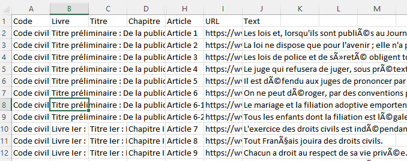

# Exercise for Next Week

<u> Exercise 10</u> Using what you have learned so far, you'll scrap Legifrance, and recreate a csv file containing 
the entire Code civil, with the proper titles and subtitles. Every row should be one article, with the following 
columns: code, livre, titre, chapitre, section, sous-section, article_num, url, and text.

Don't forget that .html elements can be analysed (and parsed) like an XML file !

