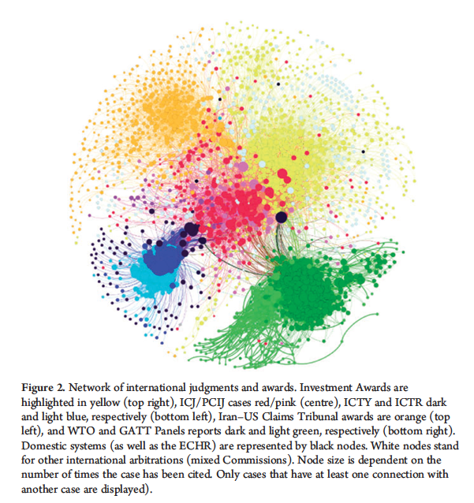

# Preparing the Dataset

<b>1. </b> Today's goal is to create, and analyse, a number of networks. 

Network Analysis refers to a set of methods to analyze and display the relationship (“ties”) between data points 
(“nodes”), and has emerged as a versatile analytical tool. This method is perhaps best known for its visualizations: ties connect nodes to produce spider webs that cluster the most connected nodes at its center. 

Aside from visualizing complex relationships, network analysis also comes with a set of useful metrics e.g., to measure the place of a node in a network (“centrality”), find groupings (“modularity”), or to assess the connectedness of networks (“density”). In addition, network science comes with concepts that can be applied across domains. For example, the idea of “preferential attachment” (i.e., nodes with a lot of ties are more likely to attract new ties than nodes with few ties) can in part help explain the frequent reappointments of star arbitrators or the continued reliance on old precedents.

<b>2. </b> But before doing all this, we need the data to create a network ! While network analysis is typically used to represent social connections (e.g., the arbitrators sitting on the same tribunal)  or document links (e.g., citations between investment awards),  only creativity limits what can be represented as nodes and ties.

Today we'll study a citation network from the French Code Civil. Individual articles will be the nodes, and 
citations or cross-references to other articles will be the ties. In addition, we'll collect some metadata about the 
nodes, such as the book or chapters they are included in.

But to do that, you first need to collect the data - those edges and nodes, and put them in a set. When you scraped 
Légifrance for the Code civil, you might have noticed that each article's page also offered you indications as to 
cited by/cite to, which we could use, although it's time-consuming to scrap. Instead, we'll just create our network from plain-text.

Do note however that there are plenty of ways to refer to other articles; besides, it's quite frequent for the Code 
civil to refer to other codes as well, or to laws that are not codified yet, so you need to provide for this.
